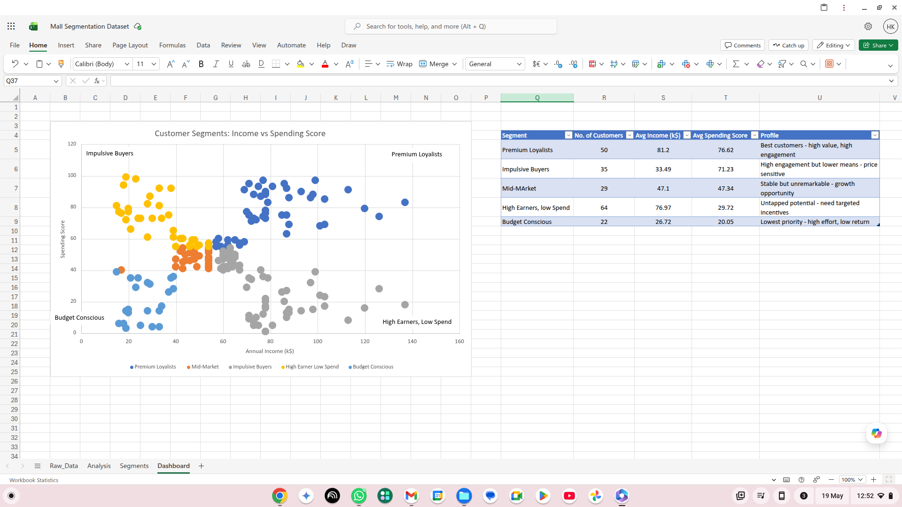

# Customer Segmentation Analysis
**Tool:** Microsoft Excel  
**Dataset:** Mall Customer Segmentation Data — [Kaggle](https://www.kaggle.com/datasets/vjchoudhary7/customer-segmentation-tutorial-in-python)

---

## Business Problem

Businesses often treat all customers the same — same messaging, same offers, same budget allocation. This analysis answers the question:

**Which customer segments exist within this customer base, and how should a business prioritise its marketing efforts across them?**

Understanding who your customers are allows businesses to focus retention spend on high-value segments, design targeted re-engagement strategies for untapped groups, and avoid wasting budget on low-return segments.

---

## Dataset

- **Source:** Kaggle — Mall Customer Segmentation Data
- **Size:** 200 customers × 5 columns
- **Columns used:** CustomerID, Gender, Age, Annual Income (k$), Spending Score (1–100)

The Spending Score (1–100) is a metric assigned by the mall based on customer behaviour and purchase history. A higher score indicates higher engagement and spend.

---

## Tools Used

- Microsoft Excel (Pivot Tables, Scatter Chart, Conditional Formatting, IF formulas)

---

## Methodology

1. **Data exploration** — reviewed all 200 rows for nulls, inconsistencies and column types. Data was clean with no missing values.
2. **Age grouping** — added an Age Group column to bucket customers into five bands (18–25, 26–35, 36–45, 46–55, 55+) for demographic analysis.
3. **Segment classification** — created a Segment column using nested IF logic based on Annual Income and Spending Score thresholds (split at 55 for both variables), producing five distinct customer segments.
4. **Pivot table analysis** — built pivot tables breaking down average income, average spending score, and customer count by segment, age group, and gender.
5. **Scatter plot visualisation** — plotted Annual Income (X axis) vs Spending Score (Y axis) with each segment as a separate colour-coded data series, clearly revealing the five natural clusters.

---

## Segment Results

| Segment | Customers | Avg Income (k$) | Avg Spending Score | Profile |
|---|---|---|---|---|
| Premium Loyalists | 50 | £81.2k | 76.62 | Best customers — high value, high engagement |
| Impulsive Buyers | 35 | £33.49k | 71.23 | High engagement but lower means — price sensitive |
| Mid-Market | 29 | £47.1k | 47.34 | Stable but unremarkable — growth opportunity |
| High Earners, Low Spend | 64 | £76.97k | 29.72 | Untapped potential — need targeted incentives |
| Budget Conscious | 22 | £26.72k | 20.05 | Lowest priority — high effort, low return |

---

## Key Findings

- **Premium Loyalists (25% of customers)** are the most valuable segment, combining high income with strong spending behaviour. Retaining this group should be the top priority — loyalty programmes, early access and personalised offers will resonate most.

- **High Earners, Low Spend is the biggest opportunity.** This is the largest segment (64 customers, 32% of the base) with strong income (avg £76.97k) but a spending score of just 29.72. They have the financial means to spend significantly more — they simply are not engaged enough. Targeted incentives, exclusive products, or premium positioning could convert this segment into high-value customers.

- **Impulsive Buyers are engaged but financially constrained.** With a spending score of 71.23 on an average income of just £33.49k, this group is already highly engaged. The focus here should be on maintaining loyalty through value-driven offers, flash sales, and bundle deals — rather than pushing premium pricing.

- **Budget Conscious customers (22 customers)** represent the lowest commercial priority. Low income and low spending score suggest limited upside even with significant marketing investment.

---

## Business Recommendations

1. **Protect Premium Loyalists** — introduce a loyalty or rewards programme to increase retention. This group drives disproportionate value and is most at risk from competitor poaching.

2. **Re-engage High Earners, Low Spend** — this is the highest-potential growth opportunity. Test premium product lines, personalised outreach, and exclusive member benefits to shift their spending score upward.

3. **Retain Impulsive Buyers with value-led marketing** — flash sales, time-limited discounts, and bundle offers will maintain their high engagement without requiring an income they don't have.

4. **Invest minimally in Budget Conscious** — do not ignore this segment entirely, but avoid disproportionate marketing spend. Standard communications are sufficient.

---

## Dashboard

---

## How to Use

1. Download `Mall_Customers.csv` from the Kaggle link above
2. Open `Customer_Segmentation.xlsx`
3. Navigate through the four sheets: **Raw Data → Analysis → Segments → Dashboard**
4. The Dashboard sheet contains the scatter plot and segment summary table

---

## About HK Analytics

Independent data analytics consultancy helping small businesses understand their data.  
[Linktree](https://linktr.ee/hkanalyticsuk) | [LinkedIn](#) | hkanalyticsuk@gmail.com
